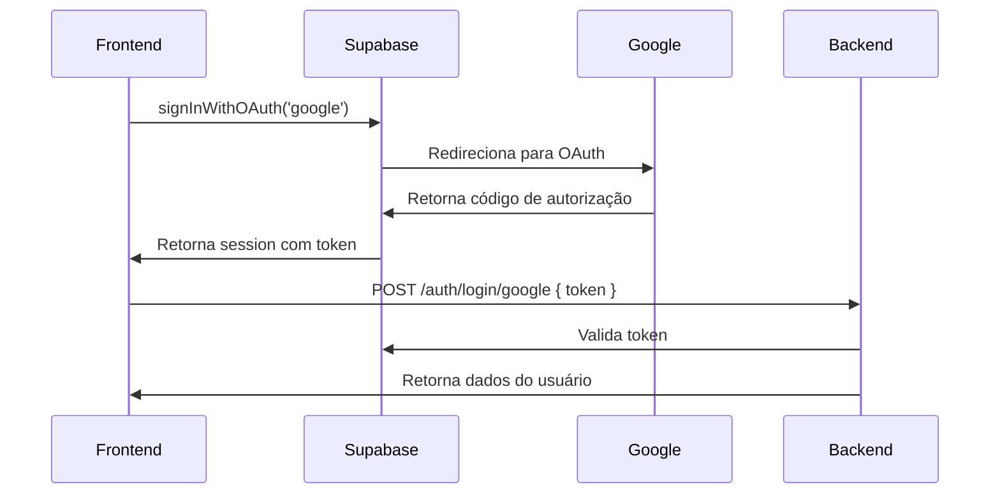

# 🔐 Guia: Como Implementar Login com Google no Frontend

## 📋 **Fluxo Completo de Autenticação**

### **1. Frontend → Supabase → Google → Frontend → Backend**



---

## 🚀 **Implementação no Frontend**

### **1. Configuração do Supabase Client:**
```javascript
// lib/supabase.js
import { createClient } from '@supabase/supabase-js'

const supabaseUrl = 'https://seu-projeto.supabase.co'
const supabaseAnonKey = 'sua-anon-key'

export const supabase = createClient(supabaseUrl, supabaseAnonKey)
```

### **2. Hook para Login com Google:**
```javascript
// hooks/useGoogleLogin.js
import { useState } from 'react'
import { supabase } from '../lib/supabase'

export const useGoogleLogin = () => {
  const [loading, setLoading] = useState(false)
  const [error, setError] = useState(null)

  const loginWithGoogle = async () => {
    try {
      setLoading(true)
      setError(null)

      // 1. Iniciar OAuth com Google via Supabase
      const { data, error: authError } = await supabase.auth.signInWithOAuth({
        provider: 'google',
        options: {
          redirectTo: `${window.location.origin}/auth/callback`
        }
      })

      if (authError) {
        throw new Error(authError.message)
      }

      // O usuário será redirecionado para o Google
      // Após autorização, voltará para /auth/callback
      
    } catch (err) {
      setError(err.message)
    } finally {
      setLoading(false)
    }
  }

  return { loginWithGoogle, loading, error }
}
```

### **3. Página de Callback (`/auth/callback`):**
```javascript
// pages/auth/callback.js (Next.js) ou components/AuthCallback.js (React)
import { useEffect, useState } from 'react'
import { useRouter } from 'next/router' // Next.js
// import { useNavigate } from 'react-router-dom' // React Router
import { supabase } from '../../lib/supabase'

export default function AuthCallback() {
  const router = useRouter() // Next.js
  // const navigate = useNavigate() // React Router
  const [loading, setLoading] = useState(true)
  const [error, setError] = useState(null)

  useEffect(() => {
    const handleAuthCallback = async () => {
      try {
        // 2. Capturar a sessão após redirecionamento
        const { data: { session }, error: sessionError } = await supabase.auth.getSession()
        
        if (sessionError) {
          throw new Error(sessionError.message)
        }

        if (session) {
          // 3. Enviar token para seu backend
          const response = await fetch('https://back-end-rosia02.vercel.app/auth/login/google', {
            method: 'POST',
            headers: {
              'Content-Type': 'application/json'
            },
            body: JSON.stringify({
              token: session.access_token
            })
          })

          if (!response.ok) {
            throw new Error('Erro ao autenticar com o backend')
          }

          const userData = await response.json()
          
          // 4. Salvar dados no localStorage
          localStorage.setItem('user_token', userData.session.access_token)
          localStorage.setItem('user_data', JSON.stringify(userData.user))
          
          // 5. Redirecionar para dashboard ou página inicial
          router.push('/dashboard')
          // navigate('/dashboard')
        } else {
          throw new Error('Nenhuma sessão encontrada')
        }
      } catch (err) {
        setError(err.message)
        console.error('Erro no callback:', err)
        
        // Redirecionar para login em caso de erro
        setTimeout(() => {
          router.push('/login')
          // navigate('/login')
        }, 3000)
      } finally {
        setLoading(false)
      }
    }

    handleAuthCallback()
  }, [])

  if (loading) {
    return (
      <div className="flex items-center justify-center min-h-screen">
        <div className="text-center">
          <div className="animate-spin rounded-full h-12 w-12 border-b-2 border-blue-600 mx-auto mb-4"></div>
          <p>Finalizando login...</p>
        </div>
      </div>
    )
  }

  if (error) {
    return (
      <div className="flex items-center justify-center min-h-screen">
        <div className="text-center text-red-600">
          <p className="mb-4">Erro no login: {error}</p>
          <p>Redirecionando...</p>
        </div>
      </div>
    )
  }

  return null
}
```

### **4. Componente de Login:**
```javascript
// components/LoginForm.js
import { useGoogleLogin } from '../hooks/useGoogleLogin'

export default function LoginForm() {
  const { loginWithGoogle, loading, error } = useGoogleLogin()

  return (
    <div className="max-w-md mx-auto mt-8 p-6 bg-white rounded-lg shadow-md">
      <h2 className="text-2xl font-bold mb-6 text-center">Login</h2>
      
      {error && (
        <div className="mb-4 p-3 bg-red-100 border border-red-400 text-red-700 rounded">
          {error}
        </div>
      )}
      
      <button
        onClick={loginWithGoogle}
        disabled={loading}
        className="w-full flex items-center justify-center px-4 py-2 border border-gray-300 rounded-md shadow-sm bg-white text-sm font-medium text-gray-700 hover:bg-gray-50 disabled:opacity-50"
      >
        {loading ? (
          <div className="animate-spin rounded-full h-4 w-4 border-b-2 border-gray-600 mr-2"></div>
        ) : (
          <svg className="w-4 h-4 mr-2" viewBox="0 0 24 24">
            <path fill="#4285F4" d="M22.56 12.25c0-.78-.07-1.53-.2-2.25H12v4.26h5.92c-.26 1.37-1.04 2.53-2.21 3.31v2.77h3.57c2.08-1.92 3.28-4.74 3.28-8.09z"/>
            <path fill="#34A853" d="M12 23c2.97 0 5.46-.98 7.28-2.66l-3.57-2.77c-.98.66-2.23 1.06-3.71 1.06-2.86 0-5.29-1.93-6.16-4.53H2.18v2.84C3.99 20.53 7.7 23 12 23z"/>
            <path fill="#FBBC05" d="M5.84 14.09c-.22-.66-.35-1.36-.35-2.09s.13-1.43.35-2.09V7.07H2.18C1.43 8.55 1 10.22 1 12s.43 3.45 1.18 4.93l2.85-2.22.81-.62z"/>
            <path fill="#EA4335" d="M12 5.38c1.62 0 3.06.56 4.21 1.64l3.15-3.15C17.45 2.09 14.97 1 12 1 7.7 1 3.99 3.47 2.18 7.07l3.66 2.84c.87-2.6 3.3-4.53 6.16-4.53z"/>
          </svg>
        )}
        {loading ? 'Entrando...' : 'Entrar com Google'}
      </button>
    </div>
  )
}
```

---

## ⚙️ **Configurações Necessárias**

### **1. No Supabase Dashboard:**
```
Authentication → Settings → Auth Providers → Google

✅ Enable Google provider
📝 Client ID: seu-google-client-id
📝 Client Secret: seu-google-client-secret
📝 Redirect URL: https://seu-projeto.supabase.co/auth/v1/callback
```

### **2. No Google Console:**
```
APIs & Services → Credentials → OAuth 2.0 Client IDs

📝 Authorized JavaScript origins:
   - http://localhost:3000 (desenvolvimento)
   - https://seu-site.com (produção)

📝 Authorized redirect URIs:
   - https://seu-projeto.supabase.co/auth/v1/callback
```

### **3. Variáveis de Ambiente (.env.local):**
```env
NEXT_PUBLIC_SUPABASE_URL=https://seu-projeto.supabase.co
NEXT_PUBLIC_SUPABASE_ANON_KEY=sua-anon-key
NEXT_PUBLIC_BACKEND_URL=https://back-end-rosia02.vercel.app
```

---

## 📡 **Comunicação com o Backend**

### **Endpoint que o Frontend deve chamar:**
```javascript
// POST https://back-end-rosia02.vercel.app/auth/login/google
{
  "token": "eyJhbGciOiJIUzI1NiIsInR5cCI6IkpXVCJ9..."
}
```

### **Resposta do Backend:**
```javascript
{
  "success": true,
  "user": {
    "id": "user_123",
    "email": "usuario@gmail.com",
    "name": "João Silva",
    "avatar": "https://lh3.googleusercontent.com/...",
    "provider": "google"
  },
  "session": {
    "access_token": "eyJhbGciOiJIUzI1NiIsInR5cCI6IkpXVCJ9...",
    "refresh_token": "refresh_token_here",
    "expires_at": 1642694400
  }
}
```

---

## 🔒 **Para Login de Admin**

### **Verificar se é Admin após login:**
```javascript
// Após receber resposta do backend
const userData = await response.json()

// Verificar se é admin
const isAdminResponse = await fetch('https://back-end-rosia02.vercel.app/auth/me', {
  headers: {
    'Authorization': `Bearer ${userData.session.access_token}`
  }
})

const userProfile = await isAdminResponse.json()

if (userProfile.user.isAdmin) {
  // Salvar como admin
  localStorage.setItem('isAdmin', 'true')
  localStorage.setItem('admin_token', userData.session.access_token)
  
  // Redirecionar para admin
  router.push('/admin/dashboard')
} else {
  // Usuário normal
  router.push('/dashboard')
}
```

---

## ✅ **Checklist de Implementação**

- [ ] Configurar Supabase client
- [ ] Configurar Google OAuth no Supabase
- [ ] Configurar Google Console
- [ ] Criar hook useGoogleLogin
- [ ] Criar página /auth/callback
- [ ] Implementar botão de login
- [ ] Testar fluxo completo
- [ ] Implementar tratamento de erros
- [ ] Adicionar loading states
- [ ] Testar em produção

**Agora o frontend está pronto para se comunicar com seu backend! 🚀**